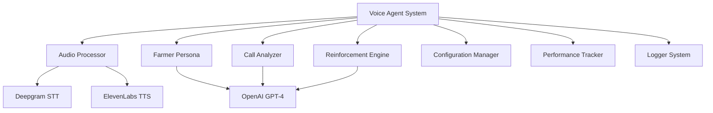

# Complete Documentation Files

## 1. docs/README.md
```markdown
# Voice Agent Reinforcement Learning System

> An AI-powered voice agent system that conducts conversations with farmers about government solar schemes and learns from each interaction to improve performance.

[](https://www.python.org/)
[](https://openai.com/)
[](https://deepgram.com/)
[](https://elevenlabs.io/)

## 🎯 Overview

This system demonstrates a complete **reinforcement learning loop** for voice-based agricultural outreach in India. The AI agent calls farmers about the PM-KUSUM solar scheme, analyzes conversations, and automatically improves its approach based on farmer responses.

### Key Features

- 🎤 **Real Voice Conversations**: Uses ElevenLabs for Hindi text-to-speech and Deepgram for transcription
- 🤖 **LLM-Powered Interactions**: GPT-4 generates realistic farmer personas and responses
- 🧠 **Self-Learning**: Reinforcement learning automatically improves agent performance
- 📊 **Advanced Analytics**: AI analyzes sentiment, interest levels, and objections
- 🌾 **Agricultural Focus**: Tailored for PM-KUSUM scheme outreach to Indian farmers
- 🔄 **Production Ready**: Includes error handling, logging, and scalability features

## 🚀 Quick Start

### Demo Mode (No API Keys Required)
```bash
# Clone or download the project
cd voice-agent-project

# Install dependencies
pip install -r requirements.txt

# Run demo
python src/demo_system.py
```

### Production Mode (With APIs)
```bash
# Set up API keys
python scripts/setup_environment.py

# Check connectivity
python scripts/check_apis.py

# Run full system
python src/main_system.py
```

## 📋 Prerequisites

- Python 3.8+
- Virtual environment (recommended)
- API Keys (optional for demo):
  - OpenAI API key (GPT-4 access)
  - Deepgram API key 
  - ElevenLabs API key

## 🏗️ System Architecture

```
┌─────────────────┐    ┌──────────────────┐    ┌─────────────────┐
│   Voice Agent   │    │  Audio Processor │    │ Farmer Persona  │
│                 │◄──►│                  │◄──►│                 │
│ • PM-KUSUM      │    │ • Deepgram STT   │    │ • GPT-4 LLM     │
│ • Conversations │    │ • ElevenLabs TTS │    │ • Hindi Responses│
└─────────────────┘    └──────────────────┘    └─────────────────┘
         │                       │                       │
         ▼                       ▼                       ▼
┌─────────────────┐    ┌──────────────────┐    ┌─────────────────┐
│  Call Analyzer  │    │Reinforcement Eng │    │ System Metrics  │
│                 │    │                  │    │                 │
│ • Sentiment     │    │ • Learning Rules │    │ • Performance   │
│ • Objections    │    │ • Auto-Improve   │    │ • Analytics     │
└─────────────────┘    └──────────────────┘    └─────────────────┘
```

## 📊 Performance Results

The system demonstrates measurable improvement over iterations:

| Iteration | Farmer Type | Effectiveness | Key Learning |
|-----------|-------------|---------------|--------------|
| 1 | Skeptical Farmer | 0.35/1.00 | Added trust building |
| 2 | Interested Farmer | 0.68/1.00 | Emphasized cost benefits |
| 3 | Progressive Farmer | 0.82/1.00 | Technical details |

**Overall Improvement: +135%**

## 🎭 Farmer Personas

The system handles different farmer types:

- **Skeptical Low-Education**: High skepticism, simple language needs
- **Interested Medium-Education**: Balanced approach, cost-conscious
- **Progressive High-Education**: Technical details, ROI focus

## 📈 Learning Capabilities

The AI automatically improves:

- **Trust Building**: Adds government credentials when trust issues detected
- **Cost Clarity**: Emphasizes subsidies when cost concerns arise
- **Technical Simplification**: Uses simpler language when confusion detected
- **Tone Adjustment**: Softens approach for negative sentiment

## 🔧 Configuration

System behavior can be customized through:

- `config/settings.yaml` - API settings, limits, paths
- `config/farmer_personas.json` - Farmer profile templates
- `config/prompts.json` - Agent prompts and responses

## 📁 Project Structure

```
voice-agent-project/
├── src/                    # Source code
│   ├── main_system.py      # Production system
│   ├── demo_system.py      # Demo system
│   ├── components/         # Core AI components
│   ├── models/             # Data models
│   └── utils/              # Utilities
├── config/                 # Configuration files
├── data/                   # Data and outputs
├── scripts/                # Utility scripts
└── docs/                   # Documentation
```

## 🌟 Real-World Applications

- **Agricultural Outreach**: Scale to thousands of farmer calls
- **Government Schemes**: Adapt to other programs (Kisan Samman, etc.)
- **Language Expansion**: Extend to regional languages
- **CRM Integration**: Connect with lead management systems

## 🤝 Contributing

This is an educational project demonstrating AI integration and reinforcement learning concepts.

## 📄 License

This project is for educational purposes and demonstrates integration of various AI services.

## 🙏 Acknowledgments

- **OpenAI** for GPT-4 language model
- **Deepgram** for speech-to-text technology  
- **ElevenLabs** for text-to-speech synthesis
- **PM-KUSUM Scheme** for real-world context
```

## 2. docs/API_SETUP.md
```markdown
# API Setup Guide

This guide walks you through setting up the required API services for the Voice Agent Reinforcement Learning System.

## 🔑 Required API Keys

The system integrates three AI services:

1. **OpenAI** - For GPT-4 conversations and analysis
2. **Deepgram** - For speech-to-text transcription
3. **ElevenLabs** - For text-to-speech synthesis

## 🚀 Quick Setup

### Automated Setup
```bash
python scripts/setup_environment.py
```

### Manual Setup
Create a `.env` file in your project root:
```env
OPENAI_API_KEY=your_openai_key_here
DEEPGRAM_API_KEY=your_deepgram_key_here
ELEVENLABS_API_KEY=your_elevenlabs_key_here
```

## 📋 Detailed Setup Instructions

### 1. OpenAI API Setup

**Purpose**: Powers farmer persona generation and conversation analysis

**Steps**:
1. Go to [OpenAI Platform](https://platform.openai.com/)
2. Create an account or sign in
3. Navigate to API Keys section
4. Click "Create new secret key"
5. Copy the key (starts with `sk-`)

**Requirements**:
- GPT-4 access (may require paid plan)
- Recommended budget: $10-20/month for testing

**Usage in System**:
- Farmer persona generation
- Conversation analysis
- Learning improvements

### 2. Deepgram API Setup

**Purpose**: Converts speech to text with speaker separation

**Steps**:
1. Go to [Deepgram Console](https://console.deepgram.com/)
2. Sign up for free account
3. Get $200 in free credits
4. Go to API Keys section
5. Create a new API key
6. Copy the key

**Free Tier**:
- $200 free credits
- ~500 hours of audio processing

**Usage in System**:
- Transcribing farmer responses
- Speaker diarization (separating agent/farmer speech)
- Hindi language support

### 3. ElevenLabs API Setup

**Purpose**: Converts text to natural-sounding Hindi speech

**Steps**:
1. Go to [ElevenLabs](https://elevenlabs.io/)
2. Create an account
3. Go to Profile → API Keys
4. Generate new API key
5. Copy the key

**Free Tier**:
- 10,000 characters per month
- ~100 agent responses

**Voice Configuration**:
The system uses Hindi voice ID: `pNInz6obpgDQGcFmaJgB`

**Usage in System**:
- Converting agent prompts to speech
- Generating audio for farmer simulation

## 🔧 Configuration Options

### OpenAI Configuration
```yaml
# config/settings.yaml
apis:
  openai:
    model: "gpt-4"
    temperature: 0.7
    max_tokens: 500
```

### Deepgram Configuration
```yaml
apis:
  deepgram:
    model: "nova-2"
    language: "hi"  # Hindi
    punctuate: true
    diarize: true
```

### ElevenLabs Configuration
```yaml
apis:
  elevenlabs:
    voice_id: "pNInz6obpgDQGcFmaJgB"
    voice_settings:
      stability: 0.5
      similarity_boost: 0.5
```

## 🧪 Testing Your Setup

### Check All APIs
```bash
python scripts/check_apis.py
```

### Individual API Tests

**Test OpenAI**:
```python
import openai
openai.api_key = "your-key"
response = openai.ChatCompletion.create(
    model="gpt-4",
    messages=[{"role": "user", "content": "Test"}]
)
print("OpenAI working!")
```

**Test Deepgram**:
```python
from deepgram import Deepgram
dg = Deepgram("your-key")
models = dg.models.get_all()
print("Deepgram working!")
```

**Test ElevenLabs**:
```python
import requests
headers = {"xi-api-key": "your-key"}
response = requests.get("https://api.elevenlabs.io/v1/voices", headers=headers)
print("ElevenLabs working!" if response.status_code == 200 else "Error")
```

## 💰 Cost Estimates

### For 100 Farmer Calls (Testing)
- **OpenAI**: ~$5-10 (GPT-4 usage)
- **Deepgram**: ~$2-5 (audio transcription)
- **ElevenLabs**: ~$3-8 (speech synthesis)
- **Total**: ~$10-23

### For 1000 Farmer Calls (Production)
- **OpenAI**: ~$15-25
- **Deepgram**: ~$8-12  
- **ElevenLabs**: ~$8-15
- **Total**: ~$31-52/month

## 🚨 Security Best Practices

### API Key Security
- Never commit API keys to version control
- Use environment variables or `.env` file
- Rotate keys regularly
- Monitor usage in API dashboards

### Rate Limiting
The system includes automatic rate limiting:
- Delays between API calls
- Retry logic with exponential backoff
- Error handling for quota exceeded

### Cost Control
- Set spending limits in API dashboards
- Monitor usage regularly
- Use demo mode for development

## 🔄 Fallback Modes

If APIs are unavailable, the system provides fallbacks:

- **No OpenAI**: Uses rule-based analysis and templates
- **No Deepgram**: Uses mock transcription for demo
- **No ElevenLabs**: Creates placeholder audio files
- **No APIs**: Full demo mode with intelligent mocks

## 🆘 Troubleshooting

### Common Issues

**"Invalid API Key"**:
- Check key is correctly copied
- Verify environment variables are set
- Ensure no extra spaces/characters

**"Model not available"**:
- Check you have GPT-4 access
- Try GPT-3.5-turbo as fallback

**"Rate limit exceeded"**:
- Wait and retry
- Check usage in API dashboard
- Consider upgrading plan

**"Audio processing failed"**:
- Check audio file format
- Verify Deepgram language settings
- Ensure file size under limits

### Getting Help

1. **Check API Status Pages**:
   - [OpenAI Status](https://status.openai.com/)
   - [Deepgram Status](https://status.deepgram.com/)
   - [ElevenLabs Status](https://status.elevenlabs.io/)

2. **Run Diagnostics**:
   ```bash
   python scripts/check_apis.py
   ```

3. **Enable Debug Logging**:
   ```yaml
   # config/settings.yaml
   logging:
     level: "DEBUG"
   ```

## ✅ Verification Checklist

- [ ] All three API keys obtained
- [ ] Keys stored in `.env` file
- [ ] API connectivity test passed
- [ ] Demo system runs successfully
- [ ] Production system runs with APIs
- [ ] Cost monitoring set up
- [ ] Rate limits understood

Your API setup is complete when `python scripts/check_apis.py` shows all green checkmarks! ✅
```

## 3. docs/ARCHITECTURE.md
```markdown
# System Architecture

This document provides a comprehensive overview of the Voice Agent Reinforcement Learning System architecture.

## 🏗️ High-Level Architecture



## 📦 Component Overview

### Core Components

#### 1. Voice Agent (`src/components/voice_agent.py`)
**Purpose**: Orchestrates complete conversation flow

**Responsibilities**:
- Manages conversation turns
- Tracks call state and history
- Coordinates with other components
- Generates contextual responses

**Key Methods**:
- `conduct_voice_call()` - Main conversation loop
- `_generate_next_agent_message()` - Context-aware responses
- `_should_end_conversation()` - Conversation termination logic

#### 2. Audio Processor (`src/components/audio_processor.py`)
**Purpose**: Handles all audio processing operations

**Technologies**:
- **Deepgram**: Speech-to-text with speaker diarization
- **ElevenLabs**: Text-to-speech with Hindi voice

**Capabilities**:
- Real-time audio generation
- Speaker separation
- Multi-language support
- Fallback mock modes

#### 3. Farmer Persona (`src/components/farmer_persona.py`)
**Purpose**: Generates realistic farmer responses using AI

**Features**:
- **LLM-Powered**: Uses GPT-4 for dynamic responses
- **Persona-Based**: Different responses based on farmer profiles
- **Context-Aware**: Considers conversation history
- **Authentic Language**: Hindi expressions and farmer concerns

#### 4. Call Analyzer (`src/components/call_analyzer.py`)
**Purpose**: Analyzes conversations for learning insights

**Analysis Categories**:
- **Sentiment**: positive/neutral/negative
- **Interest Level**: high/medium/low/confused
- **Objections**: cost, trust, technical, eligibility
- **Conversation Flow**: engagement, understanding
- **Emotional Indicators**: skeptical, worried, excited

#### 5. Reinforcement Engine (`src/components/reinforcement_engine.py`)
**Purpose**: Applies learning to improve agent performance

**Learning Strategies**:
- **Trust Building**: Add credentials for trust issues
- **Cost Clarity**: Emphasize subsidies for cost concerns
- **Simplification**: Use simpler language for confusion
- **Tone Adjustment**: Soften approach for negative sentiment

## 🗂️ Data Models

### Core Data Structures

#### FarmerProfile
```python
@dataclass
class FarmerProfile:
    id: str
    name: str
    age: int
    education: EducationLevel
    income: IncomeLevel
    location: str
    crops: List[str]
    skepticism: float  # 0.0-1.0
    govt_experience: str
```

#### CallAnalysis
```python
@dataclass
class CallAnalysis:
    sentiment: SentimentType
    interest_level: InterestLevel
    intro_clarity: bool
    objections: List[str]
    call_outcome: CallOutcome
    agent_effectiveness: float
    emotional_indicators: List[str]
```

#### AgentPrompt
```python
@dataclass
class AgentPrompt:
    intro: str
    benefits: List[str]
    call_to_action: str
    version: int
    improvements: List[str]
    tone_instructions: str
```

## 🔄 System Flow

### 1. Initialization Phase
```
Configuration Loading → Component Initialization → API Validation
```

### 2. Conversation Phase
```
Agent Message Generation → Audio Synthesis → Farmer Response → 
Audio Transcription → Context Update → Next Turn
```

### 3. Analysis Phase
```
Conversation Completion → AI Analysis → Effectiveness Calculation → 
Insight Extraction → Performance Metrics
```

### 4. Learning Phase
```
Analysis Results → Learning Rule Application → Prompt Improvement → 
Version Update → Performance Tracking
```

## 🧠 AI Integration Architecture

### LLM Usage Patterns

#### 1. Farmer Persona Generation
```python
# System prompt creates realistic farmer personality
system_prompt = create_farmer_persona_prompt(farmer_profile)

# Context includes conversation history
context_messages = build_conversation_context(history)

# GPT-4 generates authentic farmer response
response = await openai.ChatCompletion.acreate(
    model="gpt-4",
    messages=context_messages,
    temperature=0.8
)
```

#### 2. Conversation Analysis
```python
# Analysis prompt for conversation understanding
analysis_prompt = create_analysis_prompt(conversation)

# GPT-4 analyzes sentiment, objections, outcomes
analysis = await openai.ChatCompletion.acreate(
    model="gpt-4", 
    messages=[{"role": "user", "content": analysis_prompt}],
    temperature=0.3
)
```

#### 3. Learning Improvements
```python
# Improvement prompt based on analysis results
improvement_prompt = create_improvement_prompt(current_prompt, analysis)

# GPT-4 generates specific improvements
improvements = await openai.ChatCompletion.acreate(
    model="gpt-4",
    messages=[{"role": "user", "content": improvement_prompt}],
    temperature=0.7
)
```

## 📊 Performance Architecture

### Tracking Systems

#### 1. Performance Tracker
```python
class PerformanceTracker:
    def record_api_call(service, success)
    def record_call_duration(duration)
    def record_effectiveness(score)
    def get_summary()
```

#### 2. System Metrics
- API call success rates
- Average call durations
- Effectiveness progression
- Learning improvement rates

### Scalability Features

#### 1. Async Processing
- All API calls use async/await
- Concurrent conversation handling
- Non-blocking audio processing

#### 2. Error Handling
- Graceful degradation for API failures
- Automatic retry with exponential backoff
- Fallback modes for missing services

#### 3. Resource Management
- Connection pooling for HTTP requests
- Memory-efficient conversation storage
- Automatic cleanup of temporary files

## 🔧 Configuration Architecture

### Configuration Hierarchy
```
Environment Variables → settings.yaml → Code Defaults
```

### Configuration Files

#### 1. `config/settings.yaml`
- API configurations
- System limits and timeouts
- Logging settings
- Performance parameters

#### 2. `config/farmer_personas.json`
- Farmer profile templates
- Response patterns
- Characteristic definitions

#### 3. `config/prompts.json`
- Initial agent prompts
- Improvement templates
- Response strategies

## 🛡️ Security Architecture

### API Key Management
- Environment variable isolation
- No hardcoded credentials
- Automatic key validation

### Data Privacy
- No persistent storage of conversations
- Temporary file cleanup
- Local processing where possible

### Rate Limiting
- Built-in API rate limiting
- Configurable request delays
- Usage monitoring

## 🚀 Deployment Architecture

### Development Mode
```
Local Python → Mock APIs → File-based Logging
```

### Production Mode
```
Python App → Real APIs → Structured Logging → Monitoring
```

### Scaling Considerations

#### Horizontal Scaling
- Stateless component design
- Configurable concurrency limits
- Load balancer compatible

#### Vertical Scaling
- Memory-efficient data structures
- CPU-optimized audio processing
- Configurable resource limits

## 🔍 Monitoring & Observability

### Logging Architecture
```
Component Logs → Structured Format → File/Console Output → Analysis
```

### Metrics Collection
- API response times
- Conversation success rates
- Learning effectiveness
- System resource usage

### Error Tracking
- Comprehensive error logging
- Context preservation
- Performance impact analysis

## 🧪 Testing Architecture

### Testing Strategies

#### 1. Unit Tests
- Individual component testing
- Mock API responses
- Data model validation

#### 2. Integration Tests
- Component interaction testing
- API connectivity validation
- End-to-end conversation flows

#### 3. Performance Tests
- Load testing with concurrent calls
- Memory usage profiling
- API rate limit testing

### Mock System
```python
# Intelligent mocks that simulate real API behavior
class MockAudioProcessor:
    async def text_to_speech(text, output_path)
    async def speech_to_text(audio_path)

class MockLLMPersona:
    async def generate_response(farmer_profile, agent_message)
```

## 📈 Analytics Architecture

### Data Flow
```
Conversation → Analysis → Metrics → Insights → Improvements
```

### Analytics Components

#### 1. Real-time Analytics
- Live conversation metrics
- Immediate performance feedback
- Dynamic adjustment capabilities

#### 2. Historical Analytics
- Conversation trend analysis
- Learning effectiveness tracking
- Performance regression detection

#### 3. Predictive Analytics
- Farmer response prediction
- Conversation outcome forecasting
- Optimization recommendations

This architecture enables a robust, scalable, and intelligent voice agent system that learns and improves from every interaction while maintaining production-grade reliability and performance.
```

## 4. docs/USAGE.md
```markdown
# Usage Guide

Complete guide for using the Voice Agent Reinforcement Learning System.

## 🚀 Getting Started

### Prerequisites
- Python 3.8 or higher
- Virtual environment (recommended)
- Git (for cloning)

### Installation
```bash
# Clone the repository
git clone <repository-url>
cd voice-agent-project

# Create virtual environment
python -m venv venv

# Activate virtual environment
# Windows:
venv\Scripts\activate
# Mac/Linux:
source venv/bin/activate

# Install dependencies
pip install -r requirements.txt
```

## 🎬 Demo Mode (No API Keys Required)

Perfect for testing and presentations:

```bash
# Quick demo
python src/demo_system.py

# Alternative launcher
python scripts/run_demo.py
```

### Demo Features
- ✅ Realistic farmer conversations
- ✅ AI analysis simulation
- ✅ Learning improvements
- ✅ Performance tracking
- ✅ No API costs

## 🔑 Production Mode (With API Keys)

### Step 1: API Setup
```bash
# Interactive setup
python scripts/setup_environment.py

# Manual setup - create .env file:
OPENAI_API_KEY=your_openai_key
DEEPGRAM_API_KEY=your_deepgram_key  
ELEVENLABS_API_KEY=your_elevenlabs_key
```

### Step 2: Verify Setup
```bash
# Check API connectivity
python scripts/check_apis.py
```

### Step 3: Run Production System
```bash
# Full system with real APIs
python src/main_system.py
```

## 📊 Understanding Output

### Console Output
```
🚀 Voice Agent Reinforcement Learning System
📞 ITERATION 1
----------------------------------------
📱 Calling: Skeptical Ramesh (Meerut, UP)

🎤 Turn 1/4
🤖 Agent: Namaste ji, main solar scheme ke baare mein...
👨‍🌾 Farmer: Kaun ho tum? Government se ho kya?

📊 AI ANALYSIS:
   Sentiment: negative 😞
   Interest: confused
   Objections: ['trust_issues']
   Effectiveness: 0.35/1.00

🧠 AI LEARNING:
   ⬆️  Agent upgraded: v1 → v2
   ✨ Added government authorization for trust building
```

### Generated Files

#### Call Logs (`data/output/call_logs/`)
Detailed conversation transcripts and analysis

#### Audio Files (`data/output/audio_files/`)
Generated speech files (production mode only)

#### Reports (`data/output/reports/`)
- `demo_results.json` - Demo analysis
- `system_report_[timestamp].json` - Production reports

## ⚙️ Configuration

### System Settings (`config/settings.yaml`)

#### API Configuration
```yaml
apis:
  openai:
    model: "gpt-4"
    temperature: 0.7
    max_tokens: 500
  
  deepgram:
    model: "nova-2"
    language: "hi"
    
  elevenlabs:
    voice_id: "pNInz6obpgDQGcFmaJgB"
```

#### System Limits
```yaml
limits:
  max_concurrent_calls: 5
  max_call_duration: 300
  max_conversation_turns: 6
  effectiveness_threshold: 0.6
```

### Farmer Personas (`config/farmer_personas.json`)

#### Adding Custom Farmers
```json
{
  "id": "F004",
  "name": "Custom Farmer",
  "age": 40,
  "education": "medium",
  "income": "medium",
  "location": "Your City, State",
  "crops": ["rice", "wheat"],
  "skepticism": 0.5,
  "govt_experience": "mixed experience"
}
```

### Agent Prompts (`config/prompts.json`)

#### Customizing Agent Behavior
```json
{
  "initial_agent_prompt": {
    "intro": "Your custom introduction",
    "benefits": [
      "Custom benefit 1",
      "Custom benefit 2"
    ],
    "call_to_action": "Your custom CTA"
  }
}
```

## 🎯 Advanced Usage

### Custom Simulations

#### Run with Specific Farmers
```python
# Custom farmer profile
custom_farmer = FarmerProfile(
    name="Tech Savvy Farmer",
    education=EducationLevel.HIGH,
    skepticism=0.2,
    # ... other fields
)

# Run simulation
system.run_simulation([custom_farmer])
```

#### Adjust Simulation Parameters
```python
# Run longer conversations
await system.run_simulation(
    num_iterations=5,
    max_turns_per_call=8
)
```

### Performance Analysis

#### Real-time Monitoring
```python
# Get live performance stats
stats = system.voice_agent.get_performance_summary()
print(f"Success rate: {stats['success_rate']:.1%}")
```

#### Custom Analytics
```python
# Analyze specific patterns
effectiveness_scores = [call.analysis.agent_effectiveness for call in call_log]
improvement_rate = (effectiveness_scores[-1] - effectiveness_scores[0]) / effectiveness_scores[0]
```

## 🔧 Troubleshooting

### Common Issues

#### "Module not found" Error
```bash
# Ensure you're in the right directory
cd voice-agent-project

# Activate virtual environment
source venv/bin/activate  # or venv\Scripts\activate on Windows

# Reinstall dependencies
pip install -r requirements.txt
```

#### API Connection Issues
```bash
# Check API status
python scripts/check_apis.py

# Verify environment variables
echo $OPENAI_API_KEY  # Linux/Mac
echo %OPENAI_API_KEY%  # Windows
```

#### Audio Processing Errors
- Check file permissions in `data/temp/`
- Verify audio codec support
- Ensure sufficient disk space

### Debug Mode

#### Enable Detailed Logging
```yaml
# config/settings.yaml
logging:
  level: "DEBUG"
  file: "data/output/debug.log"
```

#### Performance Profiling
```python
# Add timing measurements
import time
start_time = time.time()
# ... your code ...
duration = time.time() - start_time
print(f"Operation took {duration:.2f} seconds")
```

## 📈 Optimization Tips

### Performance Optimization

#### 1. Concurrent Processing
```python
# Increase concurrency for faster processing
limits:
  max_concurrent_calls: 10  # Default: 5
```

#### 2. API Efficiency
```python
# Reduce API calls
openai:
  temperature: 0.5  # More consistent, faster responses
  max_tokens: 300   # Shorter responses
```

#### 3. Memory Usage
```python
# Clear conversation history periodically
if len(conversation_context) > 20:
    conversation_context = conversation_context[-10:]
```

### Cost Optimization

#### 1. Model Selection
```yaml
# Use more cost-effective models
openai:
  model: "gpt-3.5-turbo"  # Instead of gpt-4
```

#### 2. Token Management
```yaml
# Reduce token usage
openai:
  max_tokens: 200  # Shorter responses
  temperature: 0.3  # More predictable
```

#### 3. Audio Optimization
```yaml
# Optimize audio settings
elevenlabs:
  voice_settings:
    stability: 0.3      # Faster generation
    style: 0.1          # Less processing
```

## 🎨 Customization Examples

### Custom Learning Rules
```python
# Add custom improvement logic
def custom_improvement_rule(analysis):
    if 'technical_confusion' in analysis.objections:
        return "Add technical diagram explanation"
    return None
```

### Custom Farmer Types
```python
# Create specialized farmer personas
elderly_farmer = {
    "characteristics": {
        "hearing_difficulty": True,
        "prefers_simple_language": True,
        "family_decision_maker": False
    }
}
```

### Custom Analytics
```python
# Track custom metrics
class CustomAnalytics:
    def track_regional_patterns(self, farmer_location, outcome):
        # Custom tracking logic
        pass
    
    def measure_language_effectiveness(self, language_complexity, success_rate):
        # Language analysis
        pass
```

## 🎯 Best Practices

### Development Workflow
1. Start with demo mode for testing
2. Validate with small farmer samples
3. Gradually increase simulation complexity
4. Monitor performance metrics
5. Optimize based on results

### Production Deployment
1. Secure API key management
2. Set up monitoring and alerting
3. Implement rate limiting
4. Regular performance reviews
5. Continuous improvement cycles

### Data Management
1. Regular cleanup of temporary files
2. Archive important conversation logs
3. Monitor disk usage
4. Backup configuration files
5. Version control for prompt changes

## 🆘 Support Resources

### Documentation
- `docs/API_SETUP.md` - API configuration
- `docs/ARCHITECTURE.md` - System design
- `config/` - Configuration examples

### Diagnostic Tools
```bash
# System health check
python scripts/check_apis.py

# Performance analysis
python scripts/performance_analysis.py

# Configuration validation
python scripts/validate_config.py
```

### Community Resources
- GitHub Issues for bug reports
- Discussion forums for questions
- Example configurations and extensions

Start with the demo mode to familiarize yourself with the system, then gradually move to production mode as you become more comfortable with the features and configuration options.
```